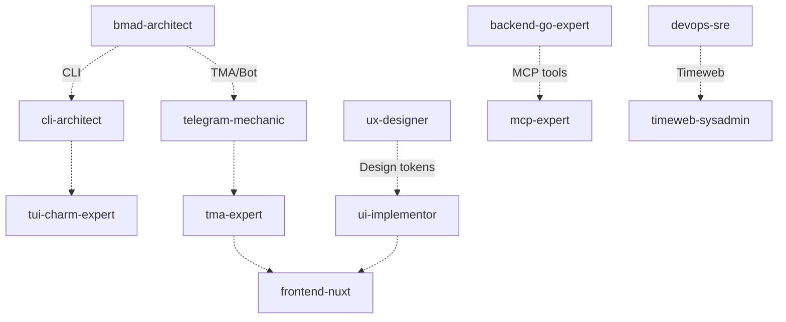

# Squad Pipeline

Visual workflow from idea to deployment across all skills.

## Core Pipeline

```mermaid
graph LR
    subgraph "🎯 DISCOVERY"
        A[User Idea] --> B[idea-interview]
        A2[New Feature] --> B2[feature-fit]
    end
    
    subgraph "📋 DEFINITION"
        B -->|"discovery-brief.md"| C[product-analyst]
        B2 -->|"feature-brief.md"| C
        C -->|"roadmap.md + specs"| D[bmad-architect]
    end
    
    subgraph "🏗️ ARCHITECTURE"
        D -->|"context-map.md"| D2[tech-spec-writer]
        D2 -->|"tech-spec.md"| E{Platform?}
        E -->|"Web/TMA"| F[frontend-nuxt]
        E -->|"All"| G[backend-go-expert]
    end
    
    subgraph "✅ DELIVERY"
        F --> G
        G -->|"TDD Loop"| G
        F -->|"TDD Loop"| F
        F --> H[qa-lead]
        G --> H
        H -->|"Tests pass"| I[devops-sre]
    end
```

## Optional Paths

These skills activate based on project type:

| Condition | Skills Activated |
|-----------|------------------|
| **TMA project** | `@tma-expert`, `@telegram-mechanic` |
| **CLI project** | `@cli-architect`, `@tui-charm-expert` |
| **MCP integration** | `@mcp-expert` |
| **Timeweb hosting** | `@timeweb-sysadmin` |
| **Custom design** | `@ux-designer` → `@ui-implementor` |
| **Status check (any phase)** | `@project-bro` |
| **Bug troubleshooting** | `@debugger` |

## Return Paths (Error Handling)

When issues are found, work flows back:

| From | To | Trigger |
|------|----|---------|
| `qa-lead` | `backend-go-expert` | Backend bugs found |
| `qa-lead` | `frontend-nuxt` | UI bugs found |
| `bmad-architect` | `product-analyst` | Specs unclear |
| `product-analyst` | `idea-interview` | Missing discovery info |

## Handoff Matrix

> [!IMPORTANT]
> **Dual-Write Pattern Required at Every Handoff:**
> 1. Draft in `brain/` → Iterate with user via `notify_user`
> 2. On approval → Persist to `project/docs/` path
> 3. Update `project/docs/ARTIFACT_REGISTRY.md` status to ✅ Done

| From | To | Artifact |
|------|-----|----------|
| `idea-interview` | `product-analyst` | `project/docs/discovery/discovery-brief.md` |
| `feature-fit` | `product-analyst` | `project/docs/features/<name>.md` |
| `product-analyst` | `bmad-architect` | `project/docs/product/roadmap.md`, `project/docs/specs/requirements.md` |
| `bmad-architect` | `tech-spec-writer` | `project/docs/architecture/context-map.md`, `project/docs/architecture/api-contracts.yaml` |
| `tech-spec-writer` | `backend-go-expert` | `project/docs/specs/<feature>-tech-spec.md` |
| `tech-spec-writer` | `frontend-nuxt` | `project/docs/specs/<feature>-tech-spec.md` |
| `ux-designer` | `ui-implementor` | `project/docs/design/tokens.json`, `project/docs/design/design-system.md` |
| `ui-implementor` | `frontend-nuxt` | `project/docs/frontend/theming.md` |
| `backend-go-expert` | `qa-lead` | `project/docs/backend/service-implementation.md` |
| `frontend-nuxt` | `qa-lead` | `project/docs/frontend/ui-implementation.md` |
| `qa-lead` | `devops-sre` | `project/docs/qa/test-report.md` |

## Phase Summary

| Phase | Owner(s) | Output |
|-------|----------|--------|
| **Discovery** | `@idea-interview` | Structured brief |
| **Definition** | `@product-analyst` | Roadmap, Specs, API contracts |
| **Architecture** | `@bmad-architect` | DDD Context Map |
| **Implementation** | `@backend-go-expert`, `@frontend-nuxt` | Code |
| **Design** (optional) | `@ux-designer` → `@ui-implementor` | Tokens, Components |
| **Delivery** | `@qa-lead` → `@devops-sre` | Tested & Deployed |
| **Status** (any time) | `@project-bro` | Project state summary |

## TDD Protocol (Hard Stop)

> [!CAUTION]
> **Implementation Phase requires Test-First compliance.**
> See: `./TDD_PROTOCOL.md`
>
> 1. **Red**: Write failing test
> 2. **Green**: Write minimal code
> 3. **Refactor**: Clean up

