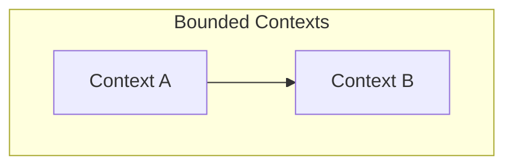

# Context Map: {WORK_UNIT}

## Upstream Documents

| Document | Owner | Status |
|----------|-------|--------|
| [user-stories](../product/{WORK_UNIT}.md) | @product-analyst | ✅ |

---

## System Overview

---

## Bounded Contexts

### Context: {Name}

| Aspect | Description |
|--------|-------------|
| **Responsibility** | ... |
| **Owner** | @skill |
| **Key Entities** | ... |

---

## Context Relationships

| From | To | Relationship | Notes |
|------|-----|--------------|-------|
| Context A | Context B | Upstream-Downstream | ... |

---

## Aggregates

### {Aggregate Name}

- **Root Entity:** ...
- **Value Objects:** ...
- **Invariants:** ...

---

## Domain Events

| Event | Trigger | Consumers |
|-------|---------|-----------|
| UserCreated | User signs up | Notifications, Analytics |

---

## Integration Points

| System | Protocol | Purpose |
|--------|----------|---------|
| Telegram | Webhook | Bot commands |
| PostgreSQL | TCP | Persistence |
