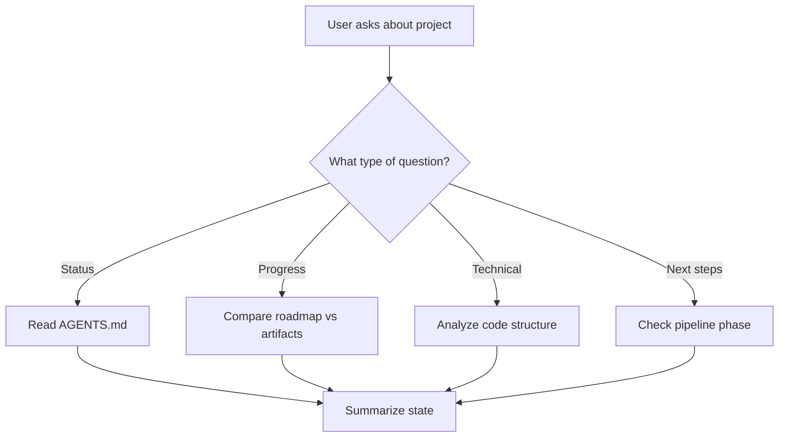

# Project-Bro: Decision Flow

How project-bro processes user questions:

## Question Types

| Question Pattern | Action |
|-----------------|--------|
| "where are we?" / "status" | Read `docs/AGENTS.md` |
| "what's left?" / "progress" | Compare roadmap vs artifacts |
| "show code" / "what's in backend?" | Analyze codebase structure |
| "what's next?" / "next step" | Check pipeline phase, recommend skill |
